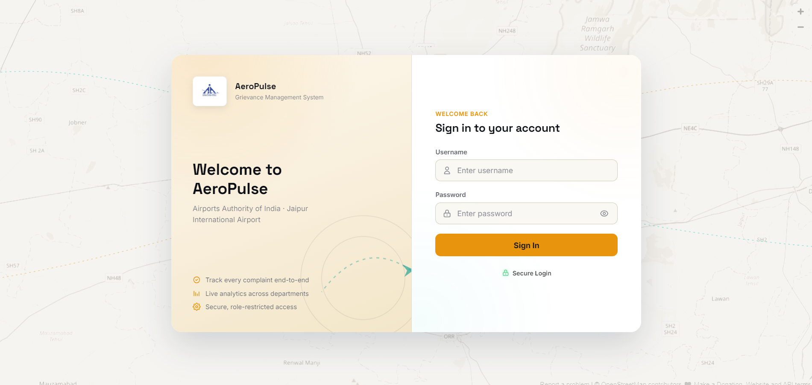
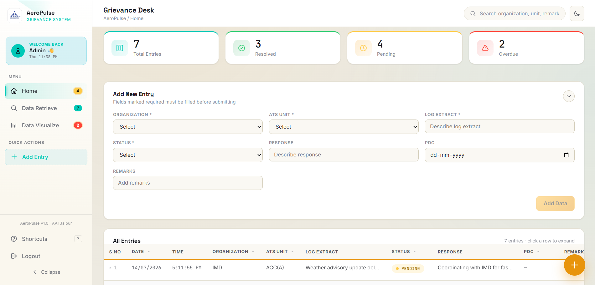
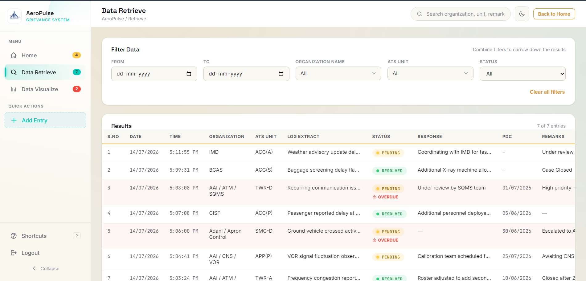

<p align="center">
  
</p>

<h1 align="center">✈️ AeroPulse Grievance Management System</h1>

<p align="center">
A modern Full-Stack Grievance Management System built to simplify complaint registration, tracking, and visualization through a secure and responsive web platform.
</p>

<p align="center">

<a href="https://aeropulse-grievance-management-system.onrender.com">

</a>


</p>

---

# 🌐 Live Demo

### 🔗 https://aeropulse-grievance-management-system.onrender.com

> **Note:** This project is deployed on Render's free tier. The server may take approximately 30–60 seconds to wake up after inactivity.

---

# 📖 Overview

AeroPulse Grievance Management System is a full-stack web application developed to streamline grievance registration and complaint management.

The system allows users to submit grievances, retrieve complaint details, and visualize complaint information through an intuitive web interface.

The backend is powered by **Node.js**, **Express.js**, and **MongoDB**, while the frontend is built using **HTML**, **CSS**, and **JavaScript**, ensuring a fast and responsive user experience.

---

# ✨ Key Features

- 🔐 Secure User Authentication
- 📝 Register New Grievances
- 🔍 Retrieve Complaints using Complaint ID
- 📊 Complaint Visualization Dashboard
- 📱 Responsive User Interface
- 🌐 REST API Architecture
- ☁ MongoDB Database Integration
- ⚡ Fast and Lightweight Design
- 📂 Modular Project Structure
- 🚀 Production Deployment on Render

---
# 🛠️ Technology Stack

<div align="center">

| Category | Technology |
|----------|------------|
| Frontend | HTML5 • CSS3 • JavaScript |
| Backend | Node.js • Express.js |
| Database | MongoDB |
| API Testing | Postman |
| Version Control | Git & GitHub |
| Deployment | Render |

</div>

---

# 🏗️ System Architecture

```text
                User
                  │
                  ▼
        AeroPulse Frontend
      (HTML • CSS • JavaScript)
                  │
                  ▼
        Express.js REST API
                  │
      ┌───────────┴───────────┐
      │                       │
      ▼                       ▼
 Authentication         Grievance APIs
      │                       │
      └───────────┬───────────┘
                  │
                  ▼
              MongoDB Atlas
```

---

# 📂 Project Structure

```text
AeroPulse-Grievance-Management-System
│
├── backend
│   ├── src
│   │   ├── config
│   │   ├── controllers
│   │   ├── middleware
│   │   ├── models
│   │   ├── routes
│   │   ├── utils
│   │   └── server.js
│   │
│   ├── package.json
│   └── .env
│
├── frontend
│   ├── assets
│   ├── css
│   ├── js
│   ├── images
│   ├── index.html
│   ├── home.html
│   ├── retrieve.html
│   └── visualize.html
│
├── README.md
└── LICENSE
```

---

# 📸 Application Preview

<div align="center">

| Login Page | Home Dashboard |
|------------|----------------|
|  |  |

| Retrieve Complaint | Visualization |
|--------------------|---------------|
|  |  |

</div>

> Replace the above screenshots with actual screenshots from your project.

---

# 🚀 Installation Guide

## Clone Repository

```bash
git clone https://github.com/ashishgupta251/AeroPulse-Grievance-Management-System.git
```

---

## Navigate to Backend

```bash
cd AeroPulse-Grievance-Management-System/backend
```

---

## Install Dependencies

```bash
npm install
```

---

## Configure Environment Variables

Create a `.env` file inside the backend directory.

```env
PORT=5000

MONGODB_URI=YOUR_MONGODB_CONNECTION_STRING

JWT_SECRET=YOUR_SECRET_KEY
```

---

## Start Backend Server

```bash
npm start
```

---

## Open Frontend

Simply open

```text
frontend/index.html
```

or run it using **Live Server**.

---
# 🔌 REST API Endpoints

## Authentication

| Method | Endpoint | Description |
|--------|----------|-------------|
| POST | `/api/auth/register` | Register a new user |
| POST | `/api/auth/login` | User login |

---

## Grievances

| Method | Endpoint | Description |
|--------|----------|-------------|
| POST | `/api/grievances` | Register a grievance |
| GET | `/api/grievances/:id` | Retrieve grievance by ID |
| GET | `/api/grievances` | Get all grievances |
| PUT | `/api/grievances/:id` | Update grievance |
| DELETE | `/api/grievances/:id` | Delete grievance |

---

# 🎯 Project Highlights

✔️ Full-Stack Web Application

✔️ Responsive User Interface

✔️ Secure REST API

✔️ MongoDB Database Integration

✔️ Express.js Backend

✔️ Modular Project Architecture

✔️ Production Deployment on Render

✔️ Clean & Maintainable Codebase

---

# 🚀 Future Enhancements

- 👨‍💼 Admin Dashboard
- 📧 Email Notifications
- 📎 File Attachments
- 📊 Advanced Analytics Dashboard
- 🔔 Real-Time Complaint Status Updates
- 👥 Role-Based Access Control
- 📄 PDF Report Generation
- 🔍 Advanced Search & Filtering
- ☁️ Cloud File Storage

---

# 📚 Learning Outcomes

Through this project, I gained hands-on experience with:

- Building RESTful APIs using Express.js
- MongoDB Database Design & CRUD Operations
- Authentication & Backend Architecture
- Frontend and Backend Integration
- Responsive Web Development
- Git & GitHub Workflow
- Deploying Full-Stack Applications on Render

---

# 🤝 Contributing

Contributions, suggestions, and improvements are welcome.

If you have ideas to improve the project, feel free to:

- Fork this repository
- Create a new branch
- Commit your changes
- Open a Pull Request

---

# 📄 License

This project is licensed under the **MIT License**.

See the `LICENSE` file for more information.

---

# 👨‍💻 Author

<div align="center">

## Ashish Gupta

Third-Year B.Tech Computer Science Engineering Student

🌐 GitHub

https://github.com/ashishgupta251

💻 Passionate about Full-Stack Development, Backend Engineering, and Cybersecurity.

</div>

---

# ⭐ Support

If you found this project useful, please consider giving it a ⭐ on GitHub.

It helps support the project and motivates future improvements.

---

<div align="center">

### ✈️ AeroPulse Grievance Management System

**Designed & Developed by Ashish Gupta**

Built with ❤️ using HTML, CSS, JavaScript, Node.js, Express.js, and MongoDB.

</div>
